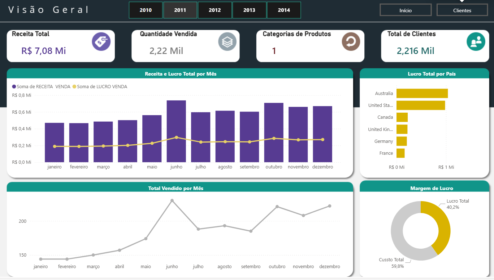

# 📊 Case de Análise de Dados – AdventureWorks (Power BI)

Este projeto apresenta um case de análise de dados desenvolvido em **Power BI**, utilizando a base **AdventureWorks**, amplamente utilizada para simular operações de uma empresa global do setor de varejo (bicicletas e acessórios).

O objetivo é demonstrar habilidades em **análise de dados, construção de indicadores e desenvolvimento de dashboards executivos**, com foco em apoio à tomada de decisão.

---

## 🎯 Objetivo do Projeto

Analisar a performance comercial da empresa considerando:

- 💰 Receita  
- 📈 Lucro  
- 📦 Quantidade Vendida  
- 👥 Clientes  
- 🌍 Países  
- 🏷️ Categorias de Produtos  

O foco foi transformar dados em informações visuais claras e estratégicas, permitindo identificar padrões de desempenho, sazonalidade e mercados relevantes.

---

## 🗂️ Base de Dados – AdventureWorks

A base AdventureWorks simula uma empresa multinacional do setor de bicicletas e acessórios e contém informações sobre:

### 🔹 Vendas
- Valor da venda  
- Lucro  
- Quantidade vendida  
- Ano e mês  

### 🔹 Produtos
- Categorias (Accessories, Bikes, Clothing)

### 🔹 Clientes
- País  
- Gênero  
- Localização geográfica  

Os dados foram utilizados para gerar análises consolidadas por período, país e categoria.

---

## 📊 Estrutura do Dashboard

O dashboard foi organizado em **duas páginas principais**:

---

# 📌 1️⃣ Visão Geral

### 📈 Receita e Lucro por Mês
- Evolução mensal das vendas  
- Identificação de sazonalidade  
- Comparação de desempenho ao longo do período selecionado  

### 📦 Quantidade Vendida por Mês
- Acompanhamento do volume de vendas  
- Relação entre volume comercializado e geração de receita  

### 🌍 Lucro por País
- Identificação dos mercados mais lucrativos  
- Comparação de performance entre regiões  

### 💰 Margem de Lucro
- Análise percentual entre lucro e custo  
- Avaliação da eficiência operacional  

### 📌 Indicadores Gerais
- Receita Total  
- Lucro Total  
- Quantidade Vendida  
- Total de Clientes  

> ⚠️ Os valores são dinâmicos e variam conforme os filtros aplicados (ano, país e demais segmentações).

---

# 📌 2️⃣ Análise de Clientes

### 💵 Receita e Lucro Consolidado
- Visão agregada da performance financeira  
- Comparação entre diferentes mercados  

### 🌎 Total de Clientes por País
- Identificação dos países com maior concentração de clientes  
- Análise de participação por região  

### 👤 Distribuição por Gênero
- Análise percentual da base de clientes  
- Avaliação do equilíbrio do público consumidor  

### 🗺️ Distribuição Geográfica
- Visualização da presença global da empresa  
- Identificação de concentração de vendas por região  

---

## 💡 Principais Insights

- O crescimento da receita acompanha o aumento da quantidade vendida ao longo do período analisado.  
- Alguns mercados concentram maior volume de clientes e lucro, indicando regiões estratégicas.  
- A margem de lucro demonstra equilíbrio entre custo e rentabilidade.  
- Há diferença de desempenho entre categorias de produtos.  
- A análise integrada permite identificar oportunidades de expansão e mitigação de riscos.  

---

## 📈 Resultado Final

O projeto resultou em um **dashboard executivo interativo no Power BI**, estruturado em duas páginas:

✔ Visão Geral de Performance  
✔ Análise de Clientes  

Incluindo:

- Indicadores financeiros dinâmicos  
- Análise temporal  
- Análise geográfica  
- Análise por categoria  
- Indicadores percentuais  
- Filtros interativos por ano e segmentações  

O foco do projeto foi transformar dados em visualizações claras, organizadas e orientadas à tomada de decisão.

---

## 🔗 Acesse o Dashboard

